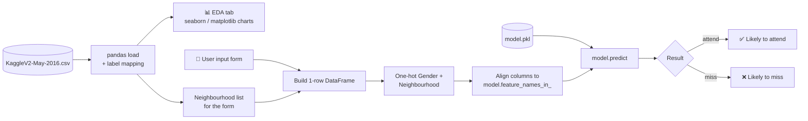

<div align="center">

# 📅 Patient No-Show Prediction

**Predict which patients are likely to miss their medical appointment, so clinics can act before the slot is wasted.**

[](https://www.python.org/)
[](https://streamlit.io/)
[](https://scikit-learn.org/)
[](https://pandas.pydata.org/)
[](#-project-status--known-issues)

[Overview](#-overview) •
[Features](#-features) •
[Quick Start](#-quick-start) •
[How It Works](#-how-it-works) •
[Dataset](#-dataset) •
[Known Issues](#-project-status--known-issues) •
[Roadmap](#-roadmap)

</div>

---

## 🩺 Overview

Missed appointments are one of the most expensive, least visible problems in outpatient care. In the public
dataset this project uses, **roughly 1 in 5 appointments ends in a no-show**. Every one of those is an idle
clinician, a longer waiting list, and a patient whose care is delayed.

This project is an interactive **Streamlit** application that:

1. **Explores** historical appointment data to surface who misses appointments and when.
2. **Predicts** whether a new patient is likely to attend, using a pre-trained scikit-learn model.

**Who it is for:** clinic operations staff and schedulers who want a quick risk signal to prioritise
reminder calls, overbooking decisions, or follow-up outreach, and data practitioners who want a
starting point for a healthcare classification problem.

> [!IMPORTANT]
> This is a **prototype / learning project**, not a clinically validated tool. Read
> [Project Status & Known Issues](#-project-status--known-issues) before relying on any output.

---

## ✨ Features

| Area | What you get |
| --- | --- |
| 📊 **Exploratory Data Analysis** | Age distribution (histogram + KDE), attendance by gender, attendance by SMS reminder, and a ranking of the top 20 neighbourhoods by attendance rate |
| 🔮 **Single-patient prediction** | A form for gender, age, scholarship (welfare) status, hypertension, diabetes, alcoholism, handicap level, SMS reminder and neighbourhood, returning an attend / miss verdict |
| 🧩 **Schema-safe inference** | Input is one-hot encoded and re-aligned to the model's `feature_names_in_`, so unseen or missing dummy columns do not break prediction |
| 🖥️ **Zero-frontend UI** | Pure Python with Streamlit. No HTML, JS or separate backend to maintain |

---

## 🏗️ How It Works



### Inference pipeline (from `app.py`)

1. The user fills in the patient form in the **🔮 Predict No-Show** tab.
2. Numeric and binary fields (`Age`, `Scholarship`, `Hipertension`, `Diabetes`, `Alcoholism`, `Handcap`, `SMS_received`) go straight into a one-row DataFrame.
3. `Gender` and `Neighbourhood` are one-hot encoded (`Gender_F`, `Gender_M`, `Neighbourhood_<name>`).
4. Any column the model expects but the row lacks is added as `0`, and columns are reordered to exactly match `model.feature_names_in_`.
5. `model.predict()` returns a class label, which is shown as a success or error banner.

### Model input schema

| Feature | Type | Values | Notes |
| --- | --- | --- | --- |
| `Age` | int | 0 – 115 | Slider in the UI |
| `Gender_F` / `Gender_M` | one-hot | 0 / 1 | From the gender select box |
| `Scholarship` | binary | 0 / 1 | Enrolled in Brazil's *Bolsa Família* welfare programme |
| `Hipertension` | binary | 0 / 1 | Spelling kept to match the source dataset |
| `Diabetes` | binary | 0 / 1 | |
| `Alcoholism` | binary | 0 / 1 | |
| `Handcap` | ordinal | 0 – 4 | Number of disabilities (source spelling kept) |
| `SMS_received` | binary | 0 / 1 | Whether a reminder SMS was sent |
| `Neighbourhood_<name>` | one-hot | 0 / 1 | One column per neighbourhood in the dataset |

---

## 🚀 Quick Start

### Prerequisites

- Python **3.9+**
- The Kaggle dataset CSV (see [Dataset](#-dataset))
- A trained `model.pkl` (see the note below)

### 1. Clone

```bash
git clone https://github.com/parth-1808/patient-no-show-predictio.git
cd patient-no-show-predictio
```

### 2. Create an environment and install dependencies

```bash
python -m venv .venv
# macOS / Linux
source .venv/bin/activate
# Windows
.venv\Scripts\activate

pip install streamlit pandas seaborn matplotlib scikit-learn joblib
```

> [!WARNING]
> A pickled scikit-learn model is only guaranteed to load with the **same scikit-learn version** it was
> trained with. Install the version that produced `model.pkl`, or you may see warnings or wrong results.

### 3. Add the data and the model

```text
patient-no-show-predictio/
├── app.py
├── model.pkl                      # ← trained model (not in the repo yet)
└── data/
    └── KaggleV2-May-2016.csv      # ← download from Kaggle (not in the repo)
```

Then point `app.py` at your CSV. **Line 8 currently contains a hard-coded Windows path**, so change it to a
relative one:

```python
df = pd.read_csv("data/KaggleV2-May-2016.csv")
```

### 4. Run

```bash
streamlit run app.py
```

The app opens at <http://localhost:8501>.

---

## 📂 Dataset

**Source:** [Medical Appointment No Shows](https://www.kaggle.com/datasets/joniarroba/noshowappointments) (Kaggle)

- ~**110,000** appointments from public health clinics in **Vitória, Espírito Santo, Brazil** (2016)
- **14 columns**, including patient demographics, chronic conditions, welfare status, SMS reminders, and scheduling / appointment dates
- Target column: **`No-show`**, where `"Yes"` means the patient **missed** the appointment and `"No"` means they **attended**
- Class balance: about **80% attended / 20% no-show**, which makes this an **imbalanced** classification problem

> [!NOTE]
> The dataset is not redistributed in this repository. Download it from Kaggle and respect its licence terms.

### Things in this data that trip people up

- **The label is inverted from intuition.** `No-show = "No"` means the patient *showed up*. Getting this backwards silently flips every chart and every prediction.
- **SMS looks like it hurts attendance.** Patients who received an SMS miss appointments *more* often. That is a confounder, not a causal effect: reminders are mostly sent for appointments booked far in advance, and long lead time is itself a strong no-show driver.
- **Data-quality quirks.** There is at least one negative `Age`, and `Handcap` is a count (0–4), not a boolean.

---

## ⚠️ Project Status & Known Issues

This is a working prototype. The following issues are real and are listed so nobody is surprised in production.

| # | Severity | Issue | Impact |
| --- | --- | --- | --- |
| 1 | 🔴 High | **Hard-coded absolute Windows path** to the CSV in `app.py` (line 8) | The app crashes on every machine except the author's |
| 2 | 🔴 High | **`model.pkl` and the training code are not in the repo** | The prediction tab cannot run from a fresh clone, and the model cannot be reproduced or audited |
| 3 | 🔴 High | **Label mapping needs verification.** `app.py` maps `No → 1` (attended) and `Yes → 0` (missed). Under that mapping, the "Top 20 Neighborhoods with Highest No-Show Rates" chart actually ranks the **highest attendance** rates, and a prediction of `0` would mean **no-show**, yet the app displays it as "likely to attend" | Charts and predictions may be inverted. Until the training script is published, confirm the model's class encoding before trusting results |
| 4 | 🟠 Medium | **Hard class output at a 0.5 threshold** on an 80/20 imbalanced target | The model will rarely flag no-shows. A risk *probability* with a tuned threshold is far more useful to schedulers |
| 5 | 🟠 Medium | **Lead time (days between booking and appointment) is not used** | This is one of the strongest predictors in this dataset and is being left on the table |
| 6 | 🟡 Low | No `requirements.txt` / pinned versions | Environment drift, and pickle compatibility issues with scikit-learn |
| 7 | 🟡 Low | The CSV is re-read and charts are re-rendered on every interaction (no `st.cache_data` / `st.cache_resource`) | Slow UI, noticeably so on hosted Streamlit |
| 8 | 🟡 Low | No evaluation metrics reported | There is no evidence yet of how well the model performs |

---

## 🗺️ Roadmap

**Make it run anywhere**
- [ ] Replace the hard-coded path with a relative path or an environment variable
- [ ] Add `requirements.txt` with pinned versions
- [ ] Cache data and model loading with `st.cache_data` / `st.cache_resource`

**Make it trustworthy**
- [ ] Commit a reproducible `train.py` (or notebook) that produces `model.pkl`
- [ ] Fix and document the target encoding end to end (`1 = no-show` is the conventional choice)
- [ ] Report ROC-AUC, PR-AUC, recall and precision on the no-show class, plus a confusion matrix
- [ ] Handle class imbalance (class weights or resampling) and tune the decision threshold

**Make it useful to a clinic**
- [ ] Engineer lead-time, weekday, and patient-history features (prior no-shows per `PatientId`)
- [ ] Show a **risk score (%)** and a Low / Medium / High band instead of a binary verdict
- [ ] Batch scoring: upload tomorrow's schedule as CSV and download it ranked by risk
- [ ] Explain each prediction (e.g. SHAP) so staff can see *why* a patient is flagged
- [ ] Add tests and a CI workflow

---

## 🧠 Responsible Use

- A no-show prediction should drive **supportive** actions (an extra reminder, a phone call, transport help), never denial of care.
- Features such as neighbourhood and welfare status can act as proxies for income and ethnicity. Audit error rates across groups before any real deployment.
- The model is trained on 2016 data from a single Brazilian city. It will not transfer to other populations without retraining and validation.
- Real patient data is subject to regulations such as HIPAA, GDPR, or Brazil's LGPD. Do not feed identifiable patient data into a hosted demo.

---

## 🛠️ Tech Stack

| Layer | Tools |
| --- | --- |
| UI | Streamlit |
| Data | pandas |
| Visualisation | seaborn, matplotlib, Streamlit native charts |
| Modelling | scikit-learn |
| Model persistence | joblib |

---

## 🤝 Contributing

Contributions are welcome, especially anything in the [Roadmap](#-roadmap).

1. Fork the repository
2. Create a branch: `git checkout -b feature/your-change`
3. Commit with a clear message
4. Open a pull request describing **what** changed and **how you verified it**

---

## 📜 License

No license file has been added yet, which means all rights are reserved by default. If you intend others to
use or build on this project, add a `LICENSE` file (MIT is a common choice for projects like this).

---

<div align="center">

Built by [**parth-1808**](https://github.com/parth-1808)

If this project helped you, consider giving it a ⭐

</div>
